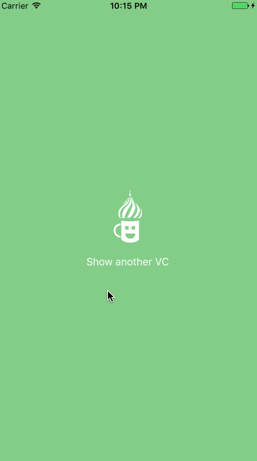
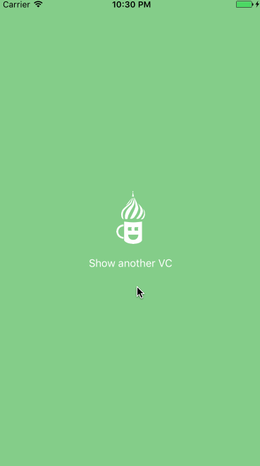

# AZTransitions
Make your modal transition with custom animation.
AZTransitions helps you think about creativity, giving specific API methods.

## Visual Example

Inside this repository you can try `iOS Example` target with example `FashionTransition.swift` class:



## Installation

- Add the following to your [`Podfile`](http://cocoapods.org/) and run `pod update`
```
    pod 'AZTransitions'
```
- or add the following to your [`Cartfile`](https://github.com/Carthage/Carthage) and run `carthage update`
```
    github "azimin/AZTransitions"
```
- or clone as a git submodule,

- or just copy ```AZTransitions/Source/CustomModalTransition.swift``` into your project.

## Code Example

To create any custom transition just subclass `CustomModalTransition`:

```swift
class FashionTransition: CustomModalTransition { 
  override init() {
    super.init(duration: 0.5)
  }
}
```
--

Then set as `az_modalTransition` to nessesary view just before presenting it 
```swift
override func prepare(for segue: UIStoryboardSegue, sender: Any?) {
  segue.destination.az_modalTransition = FashionTransition()
}
```
or
```swift
func show() {
  let viewController = UIViewController()
  viewController.az_modalTransition = FashionTransition()
  self.present(viewController, animated: true, completion: nil)
}
```
--

To have custom present animation, just implement `performTransition(interactive: Bool)` inside your `FashionTransition` class: 
```swift
func performTransition(interactive: Bool) {
  self.presentedViewController.view.alpha = 0.0
    
  UIView.animate(withDuration: duration, animations:
    {
    self.presentedViewController.view.alpha = 1.0
    self.presentingViewController.view.alpha = 0.0
  }, completion: {
    (completed) in
    self.presentingViewController.view.alpha = 1.0
    self.finishAnimation(completion: nil)
  })
}
```

As you guess you have different properties, mains is:
- `duration` transition duration
- `presentingViewController` view controller, that presenting your view controller
- `presentedViewController` view cotnroller that is going to be presented

You can animate them as you want.

**🔥IMPORTANT🔥** don't forget to call `finishAnimation(completion: nil)` in the end.

In this case animation will be:



## More

You have different properties and methods to help you:
- `performDismissingTransition(interactive: Bool)` to implement custom dismissing transition animation
- `transitionContainerView` view where transition take place (`resentingViewController.view` and `presentedViewController.view` located on inside `transitionContainerView`), so you can add you custom views here to make animation more interesting (example inside `iOS Example`)
- Some methods for interactive animations (example would be added be soon)
- Some method to work with orientation changing things (example would be added be soon)
